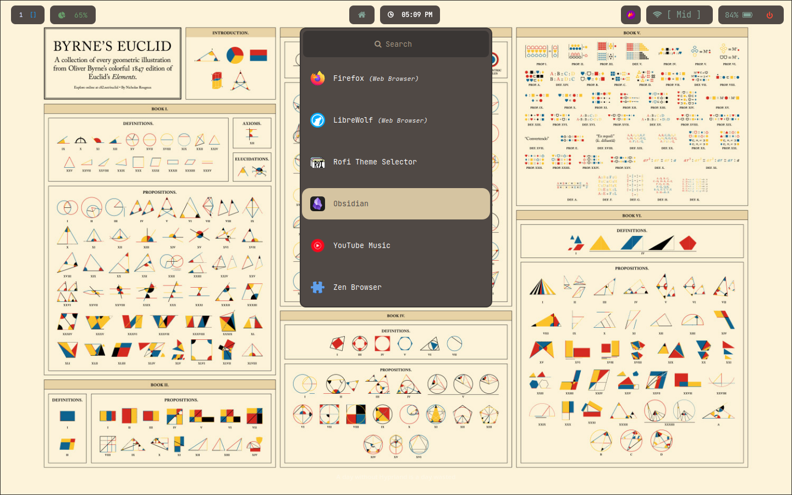
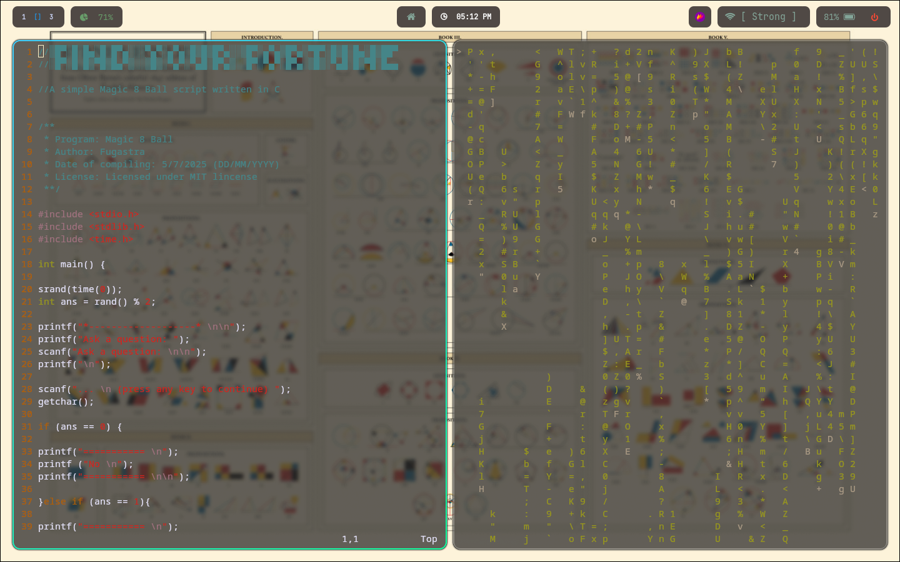
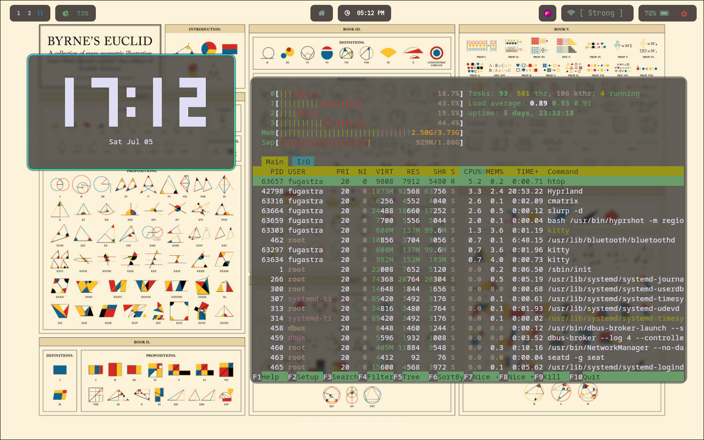

# Arch Linux + Hyprland Rice 
Dotfiles

- Author: Fugastra
- Date of uploading: 5th July, 2025
- License: GNU GPL V3 License

-===========================================-

**System info(fastfetch):**

- OS: Arch Linux x86_64
- WM: Hyprland 0.47.2 (Wayland)
- Cursor: Adwaita
- Terminal: kitty 0.39.1
- Terminal Font: NotoSansMono-Regular (11pt)

-===========================================-

## Important ⚠️

For Rofi themes:

1. **OPEN THE FOLDER NAMED rofi**
2. In **themes** (the folder)
3. the config file called **hyprofi.rasi** is the correct file, the other .rasi files are downloaded presets I forgot to delete!!!

---

For waybar:

Use the files titled
  > - config.jsonc
  > - style.css

**Do NOT use the other files**
They are also presets I downloaded that I forgot to clean up.

## Gallery 

